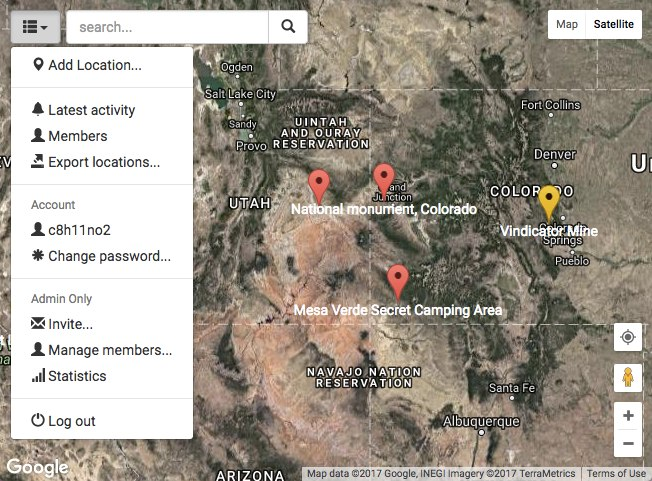

# Georap

Create a community on map. Georap is a social geographical forum platform and simple content management system to build maps and communities. Georap was created to allow users to browse, manage, and describe geolocations and share local events and notes in a fun, easy, and social manner.

Georap is for teams, groups, and organisations who want to share, document, and discuss locations. It is also for them who want to keep their data in their hands instead of tech giants. Whether the community topic is nature, constructions, urban exploration, traveling, birds, berry picking, or treasure hunting, we bet you find Georap useful.

**Table of Contents**

- [Features](#features)
- [Install](#install)
- [Environments](#environments)
- [Scripts API](#scripts-api)
- [Update and migration](#update-and-migration)
- [Database backups](#database-backups)
- [Technology stack](#technology-stack)
- [Versioning](#versioning)
- [Issues](#issues)
- [License](#license)
- [Advanced topics](#advanced-topics)

## Features

 
1/9. Georap can handle practically unlimited number of locations. Hierarchical server-side clustering of map markers keeps things smooth and fast.

 
2/9. Users create and import new locations for the community to discuss and remember. Each location receives own page and posts.

 
3/9. Posts can include text, links, and optional image or other document.

 
4/9. Users can comment posts for targeted discussion and reactions. Georap applies web sockets to provide real-time communication and automatic content refresh.

 
5/9. Marker icons can be configured to suit the aesthetic and classification needs of the community.

 
6/9. All information of the location can be edited in an intuitive and responsive way.

 
7/9. Location coordinates can be exported into external map services. The list of available services is configurable and extendable as well as the list of alternative coordinate systems.

 
8/9. Each location can be downloaded as a file and exported to other map software and devices.

 
9/9. And lots of else, like full text search, full export, member administration tools and gamification features.

Read on for technical details and installation instructions.

## Install

Georap is a web application and thus requires installation to a web server. The web server is required to provide Node.js v12, v14, or later and MongoDB v4 or later.

**First, to install Georap, clone the git repository.** For production, you only need the latest snapshot, thus `--depth 1`:

    $ git clone --depth 1 https://github.com/axelpale/georap.git

**Second, install dependencies:**

    $ cd georap
    $ npm install

**Third, create a MongoDB database.** Ensure MongoDB is installed:

    $ mongod --version

See [mongodb.org/downloads](https://www.mongodb.org/downloads) for instructions. For example on macOS:

    $ brew tap mongodb/brew
    $ brew install mongodb-community

The default config uses database named `georap` and a database user named `mongouser`. For a demo setup or development purposes, create a new database at `.data/db` and start `mongod` without `--auth`:

    $ mkdir -p .data/db
    $ mongod --dbpath=.data/db

Given that the database is empty and does not require authentication, you can now install default users `mongoadmin`, `mongouser`, and `testuser` with a script at `migration/mongo.init.js`. **Warning:** Use default users only in development.

    $ mongosh migration/mongo.init.js

For production, only one database user is needed. The user must have `readWrite` role to access the database. For further details, see [MongoDB user setup](doc/advanced.md#mongodb-user-setup).

After database users are created, start the database in authenticated mode:

    $ mongod --auth --dbpath=.data/db

In production environments, the database is probably already running and requires password authentication.

In development, it sometimes happens that a crashed mongod process stays alive somehow and reserves the default port, preventing a fresh mongod using it. In this case, try `killall mongod`.

**Fourth, configure the site.** Copy or rename `config-sample/` as `config/`.

    $ cp -R config-sample config

The directory `config/` contains the main configuration for your Georap app, including database user credentials, title of the site, Google Maps API key, marker icons, and multiple other settings. All critical config parameters required for minimal setup are grouped into `config/index.js`.

    $ nano config/index.js

Addition to the critical configuration, there are lots of non-critical parameters for you to tweak the look and feel of the site. The non-critical configuration is divided into multiple files under `config/`. See the files for further details. There is lots to explore. Take your time.

- `borders.js` - geographic borders for area-sensitive features such as third-party map services.
- `capabilities.js` - define what each user role can see and modify
- `coordinateSystems.js` - available coordinate systems
- `exportServices.js` - third-party geography services
- `filesUrls.js` - file paths for static assets and uploaded content
- `icons.js` - site favicon and app launcher icons
- `index.js` - critical configuration
- `landing.js` - initial map viewport position and login behavior
- `languages.js` - available locales
- `locations.js` - location marker types and graphics
- `posts.js` - post listing settings and content size limits
- `security.js` - encryption and developer settings
- `supportPage.js` - a custom about page
- `users.js` - user roles and activity reward settings

The config will be validated whenever it is needed, including build, server, and worker processes. If something is missing, the process exits with a message pointing to missing or invalid config properties.

**Fifth, populate the database.** This creates required MongoDB collections, initial data, and collection indices. This will also install the root admin user account you configured at `config/index.js` if it does not exist yet.

    $ npm run migrate

In the case of a major version upgrade, for example from v14.6.6 to v15.0.0, you must rerun the `migrate` to update the database schema.

**Sixth, build the Georap client app code.** A JavaScript bundle will be placed in the static file directory specified in the configuration.

    $ npm run build

In development, you can automatically rebuild the bundle after a file change with a watch process:

    $ npm run build:watch

**Seven, run the worker.** The worker computes search keywords and other cached, computation-intensive data. Single run is enough for demo and development.

    $ npm run worker

In production, you would like to run the worker hourly or so. A recommended way in Linux environments is by using `crontab`. For example, to run the worker twice in an hour:

    $ crontab -e
    5,35 * * * * /usr/bin/node /home/myname/myapp/georap/worker/index.js

**Finally, start up the server.** By default, this will begin to serve clients on port 3000. See `config/index.js` to change the port.

    $ npm start

In development, you might want to restart the server after a file change.

    $ npm run start:watch

In production, consider using a process manager that restarts the server after a process crash or machine restart. We have had good experiences with [pm2](https://pm2.keymetrics.io/):

    $ npm install pm2 -g
    $ pm2 start --name my-georap-app georap/server/index.js
    $ pm2 save
    ...
    $ pm2 reload my-georap-app
    $ pm2 stop my-georap-app
    $ pm2 delete my-georap-app

**Congratulations, all set up!** Browse to [localhost:3000](http://localhost:3000) and enjoy your new geography-based forum.

## Environments

Georap's Node server can be started in 3 environments: `development`, `production`, and `test`. Specify the environment by setting the `NODE_ENV` environment variable. The effects of each env is listed below:

- `production`: Default.
- `development`: Client app bundles are not minified.
- `test`: Used by the script `test:migration`. The `test` database is used instead of the main database. The test database is cleared and populated with fixture data before each test.

For example, to run the server in the `production` env:

    $ NODE_ENV=production node server/index.js

Alternatively use a script:

    $ npm run server:production

For other commands, see the scripts below.

## Scripts API

These helpful scripts are defined in `package.json`. See it for details.

### npm start

Alias for [npm run server:production](#npm-run-server-production)

### npm run start:watch

For development. Lint and re-run the server each time server code is modified.

### npm run build

Builds the client with webpack.

Webpack chunks the bundle. Usually a chunk contains a View. The chunk names are defined in client/routes.

### npm run build:watch

For development. Lint and rebuild the client code bundle each time client code is modified.

### npm run server:development

Requirements: MongoDB is running

Starts the server in the development env. See [Environments](#environments) for details.

### npm run server:production

Requirements: MongoDB is running

Starts the server in the production env. See [Environments](#environments) for details.

### npm run server:test

Requirements: MongoDB is running

Starts the server in the test env. See [Environments](#environments) for details.

### npm run migrate

Requirements: MongoDB is running

Creates or updates the database schema. It detects the current schema version and the migration steps required to match the version in `package.json`. For details about the migration steps, see under `migration/versions/`.

### npm run lint

Runs ESLint over the whole codebase. See `.eslintrc.js` and `client/.eslintrc.js` for configuration details.

### npm run mongo

Requirements: MongoDB is running

Starts mongo client on georap database.

### npm run mongo:test

Requirements: MongoDB is running

Starts mongo client on test database.

### npm run mongod

Warning: use only for a demo or development.

Requirements: `mongod:init` and `mongod:init:users` have been run.

Starts MongoDB in auth mode and with the path `.data/db/`.

### npm run mongod:init

Warning: use only for a demo or development.

Creates a directory for the development database. Then starts MongoDB without authentication.

### npm run mongod:init:users

Warning: use only for a demo or development. The default passwords are not secure for production.

Requirements: MongoDB without authentication is running.

Creates default MongoDB users for development.

### npm run reset

Warning: use only for a demo or development.

Warning: destroys all data in MongoDB, including MongoDB users.

Warning: destroys all backups, logs, and uploads.

Clears the project.

### npm run test

Requirements: MongoDB is running

Runs the full test suite.

### npm run test:client

Requirements: Server is running, MongoDB is running

Runs client-side tests. Will probably be deprecated in the future.

### npm run test:server

Requirements: Server is running, MongoDB is running

Runs a server API test suite.

### npm run test:migration

Requirements: MongoDB is running

Runs a migration test suite.

### npm run worker

Requirements: MongoDB is running

Executes one work cycle. A cycle includes jobs such as computing marker layers, fetching missing reverse geocodes, and building search indices. In production, the worker is meant to be invoked as a cronjob once in a while. For details, see under `worker/`.

## Update and migration

Warning: always back up before attempting to migrate. See [Database backups](#database-backups).

During development, the database schema can and will evolve. For each schema evolution step, the major package version is increased (e.g. from 1.2.3 to 2.0.0). To update old Georap or TresDB instances and their databases, we provide programmatic migration steps for each version increment and a script to execute them.

First, pull the desired Georap version from git:

    $ git pull

Then, you can run the migration by:

    $ npm run migrate

You will see output about steps taken during migration.

Under the hood, the migration script does the following:

- figures out the current database schema version
- figures out the required database schema version
- deduces required migration steps, specified under `migration/versions/`
- updates the database by executing the steps.

To update the client and server, rebuild and restart:

    $ npm run build
    $ npm run start

## Database backups

To take a snapshot of the database with [mongodump](https://docs.mongodb.com/v3.6/reference/program/mongodump/):

    $ mongodump --username <user> --password <userpwd> --db georap

If you want to take the snapshot as the admin user, add `--authenticationDatabase admin` to the command.

To restore the snapshot with [mongorestore](https://docs.mongodb.com/v3.6/reference/program/mongorestore/). Use `--drop` to drop existing collections before restore:

    $ mongorestore --username <user> --password <userpwd> --drop --db georap dump/georap

After restoring it might be necessary to run migrate and worker:

    $ npm run migrate
    $ npm run worker

In rare cases, restore can leave indices in odd state. If this happens, execute `db.<collection>.reIndex()` for each collection. However, `reIndex` requires the user to have role `dbAdmin` on the database. For development purposes `db.grantRolesToUser('mongoadmin',[{ db: 'georap', role: 'dbAdmin' }])` will do the trick.

## Technology stack

- [Google Maps JavaScript API](https://developers.google.com/maps/documentation/javascript/): maps and markers
- [Marked](https://github.com/markedjs/marked): markdown parser
- [Bootstrap](http://getbootstrap.com/): styles
- [jQuery](https://jquery.com/): DOM manipulation
- [Lodash](https://lodash.com/): utility functions
- [Webpack](https://webpack.github.io/): client code bundling
- [Socket.io](http://socket.io/): client-server connection
- [bcrypt](https://www.npmjs.com/package/bcryptjs): password hashing
- [JSON Web Tokens](https://github.com/auth0/node-jsonwebtoken): session management
- [Morgan](https://github.com/expressjs/morgan): request logging
- [Express](https://expressjs.com/): server framework
- [Node.js](https://nodejs.org/en/): runtime environment
- [MongoDB](https://docs.mongodb.com/manual/): document database

Development tools:

- [ESLint](http://eslint.org/): linting
- [Mocha](https://mochajs.org/): test runner
- [Should](http://shouldjs.github.io/): assertions

For production, we recommend:

- [DigitalOcean](https://m.do.co/c/3e63e3de8e31): cloud servers
- [Nginx](https://www.nginx.com/): reverse proxy
- [Let's Encrypt](https://letsencrypt.org/): TLS certificates

## Versioning

On the master branch, we use the [semantic versioning](http://semver.org/) scheme. The semantic version increments are bound to the operations you need to do when upgrading your Georap instance:

- MAJOR (+1.0.0) denotes a new incompatible feature. A database migration might be required after upgrade. Hyperlinks of earlier versions might not work.
- MINOR (+0.1.0) denotes a new backwards-compatible feature. Upgrading directly from the Git should not break anything.
- PATCH (+0.0.1) denotes a backwards-compatible bug fix. Upgrading or downgrading directly from the Git should not break anything.

## Issues

Report bugs and features to [GitHub issues](https://github.com/axelpale/georap/issues).

The issue labels follow [Drupal's issue priority levels](https://www.drupal.org/core/issue-priority): critical, major, normal, and minor.

## License

[MIT](LICENSE)

## Advanced topics

See [Advanced topics](doc/advanced.md) for further docs about logging, testing, git branching, and database users.
